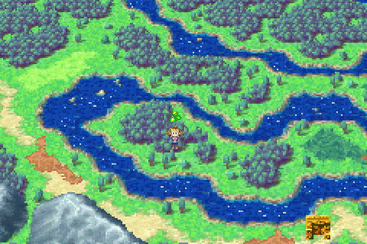
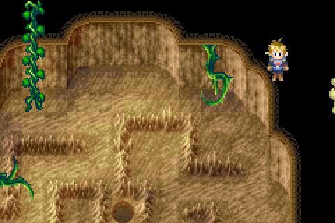

# ACE Setup For Golden Sun 1
This guide is geared towards simplicity (speed is a secondary priority), and should enable you to activate Arbitrary Code Execution even if you've never played the game before.  It should (hopefully) work for all localizations and consoles.  Summarizing the entire route, you will:
1. **Use custom names**  
```
  Isaac  |N=X
  Garet  H!.W
  Ivan   7!@Z
  Mia    ##xG
  Felix  _,MR
  Jenna  xx"Y
  Sheba  ((_T
```
2. **Set specific prologue flags**
3. **Activate the slot 8 glitch**
4. **Use slot 8 on the ACE tile**

There's nothing else you really have to do.  Most of this guide is just setup for those 4 steps.

###### For those familiar with memory editing: Step 2 does nothing but write `0xFFA8` at `02000146` (talk to neighbor, tell injured man he'll live, trigger only the last boulder).  Step 3 just writes `0xFF` at `02000040` (in Tret, stand on 0200053C with defense values of 53, 55, 56, and 57, shifting a player each time).  You can skip to [Getting to the ACE Tile](#getting-to-the-ace-tile) so long as you edit the names and flags from steps 1-3 before activating ACE.  Step 4 is just: open menu on 0200846C, then step on the nearest leaf after clearing Isaac's inventory.

## The Route


## Start a new game
At the name-selection menu, press `↑ ↓ ↑ ↓ ← → ← → ↑ → ↓ ← ↑ select` to enable you to rename everyone.  Fully release each input before pressing the next one.  You should hear a "ding" if you did it correctly.  Use the names listed above.  These names constitute the bulk of the code to be executed by the CPU when ACE is triggered.

## The Prologue


When you first gain control of Isaac, **attempt to enter your neighbor's house**.  He will pop out, say a few words, then leave.  **Do NOT step on either of the staircases leading south**, because they will trigger boulders to fall, setting unwanted flags.

Head north, **ignoring Garet** struggling with his chest.  He will stop you and join your party.  Head across the bridge, and another cutscene will be triggered.  At the staircase, **head directly left** because moving down at all triggers another unwanted boulder.

Follow the path and talk to the injured man on the ground.  When prompted with a "Yes/No" option, **select NO**.  He'll pop up and walk away.  As you proceed, enemies will appear spontaneously.  Select "Flee" (repeatedly if necessary) for all random encounters.

After exiting the room, head south, ignore the bridge, and go down the staircases.  When you reach the bottom, you will see another cutscene.  Continue heading south, and cross the bridge.  After crossing, **run north to trigger a boulder falling**.


That's the last required flag.  Progress through the story as you would normally (run south to the plaza, get help, return north to help Felix, and fight Saturos and Menardi).

## Sol Sanctum
Any route that completes Sol Sanctum without fighting enemies is fine.  To finish it quickly:
1. When you reach the third room, stand in front of the 4th pillar from the right 
2. Hotkey Retreat on L or R, drain Isaac's PP to 5 or less, then attempt to cast Retreat with your hotkey
3. Save, hard reset (equivalent to turning the game off and back on), then run Up until you pop out of a door (takes about 9 seconds of running).

Progress through the story normally (solve the statue puzzle, enter the portal, collect the stars, retreat out of Sol Sanctum, leave Vale).

## Vault
When you reach the World Map, run south-east to Vault.  Flint will stop you and give you the Djinn tutorial.  Continue to flee from random encounters.  In general, forested areas have 2-3 times the encounter rate of plains areas.

Get to the bandit fight (find Ivan in the Mayor's house, trap the thieves in the Inn, then enter the hole in the roof).  Before talking to the man tied up in the chair, **put Flint on standby, save, and hard reset.**

Initiate the fight.  Target the middle Bandit with every move.  Use the following moves:
```
Turn 1: Venus,  Flare, Ray
Turn 2: Attack, Flare, Ray
Turn 3: Attack, Flare, Ray
```
Isaac and Garet should level up, and Isaac should gain 2 defense.  You can talk to the mayor afterwards to get a Water of Life, which you can sell later for coins.  Also, you'll need to fill the first 11 slots of Garet's inventory.  An easy way to do this is by getting multiple bones from the barrel in the Inn, and giving them to Garet.

## Goma Cave
Leave Vault, and head east.  Follow the path to Goma Cave.  After casting Move on the log covered in vines, Ivan will rejoin your party.  Any route that completes this cave without fighting enemies will work.  To finish it quickly:

1. After the first room, you will be here.  Drain Isaac's PP to 5 or less, then attempt to cast Retreat with a hotkey.  

2. Save, hard reset, then run here.  Line up roughly with the wall.  

3. Run Up until you pop out of a door (takes about 11 seconds), then follow the path out of the cave

## Bilibin
Enter the weapons shop in Bilibin, and talk to the armor vendor.  Sell things until you have at least 1300 coins (water of life gives 2250).  Purchase the following items from the armor vendor: **Bronze Shield, Leather Gloves, Open Helm, Wooden Cap**.

Enter the house to the left of the weapons shop, and **collect the hard nut** in the barrel at the top.  Don't use it yet.

## On the way to Tret
Leave Bilibin, and run south-east to the barricade.  Move the box out of the way, and follow the path to the exit.  When you exit Bilibin Barricade, **standby Flint, save, and hard reset.**

Run into this corner:  


then hold **B + Right** until you get an encounter.  You should see a Dirge and a Mole.  **Cancel 1 attack** (after inputting a move for a character, press B to cancel it) to advance the rng.  Use **Flare** and **Venus** on the **Mole**, and use **Ray** on the **Dirge**.  Isaac should level up twice.


Immediately after the battle (before moving), **use the hard nut on Isaac**.  He should have 17 defense when nothing is equipped.  Equip the Bronze Shield and Wooden Cap on Isaac.  You can give Flint to Ivan to help keep him alive.

Cross the bridge to the north-east, run west to this cluster of trees, and press "A" to pick up the turtle boots.  
  

**Put the Turtle Boots in Garet's 12th item slot, and equip it.**  Then, run to Kolima Forest.

Solve the log puzzles, and continue running from everything.  Keep everyone topped up on HP, but don't worry too much if someone dies.  When you get to the floodgate room, **collect the Fur Coat from the chest, and equip it on Isaac** (it is possible to grab the coat from the other side of the log with some finagling).  Finish the room, and enter Tret.

## Tret
  

1. Run through the first two rooms, and you will pop outside on a branch

2. Drain your PP to 5 or less, then cast Retreat with a hotkey.

3. Save and hard reset, but at the title screen, select "Battle" instead of "Continue".  Before selecting your file, **wait until you hear the wood flute** melody in the menu theme (it places a useful wall out of bounds).  

4. Leave the lobby, then continue on your Tret file.

## Out of Bounds
You should now be "out-of-bounds".  You will need to listen for the "bass-notes" in the music for some instructions.  In Tret, they are evenly spaced about 1 second apart (63 frames, or 1.05 seconds to be precise), and are easy to hear.  You can also just use a stopwatch if you prefer.

While running around, you might get some "bad" encounters.  Most encounters you can simply run from and continue, but some encounters are "bad" because they impact the out of bounds landscape.  

To recognize bad encounters, you will need to count the number of enemy slots used.  Every big enemy (Creeper, Rat Soldier, Troll) uses 2 slots, and every small enemy (Drone Bee, Gnome, Rat, Spider) uses 1 slot.  An encounter is only bad if it uses 6 slots, and the enemy on the far right is small.  

If you get a bad encounter: save, hard reset, then continue wherever you left off.  If you entered battle mode on your previous reset, do that again.

## Slot 8
  

1. Run Up + Right until you see Isaac, then run into the corner shown in the image

2. Run Up + Left for at least 23 total bass notes.  Then run Right for at least 1 bass note.  Heal your party as you go.

3. **Drain your PP to 6 or less** (so that it doesn't teleport you when you run across it), save, and hard reset.  If it has been a while since your last encounter, you can wiggle left and right until you get one before saving.

4. Run Up for at least 7 bass notes (crossing the RNG river).  If you pop out somewhere else, reset (soft or hard) and try again.  If you crossed successfully, you may press "A" to "check the jar", confirming you've reached the top of the map.

5. **Unequip** the Turtle Boots on Garet but leave them in his 12th item slot (creating a wall beneath you).  Then run straight down at least half a bass note.

6. Give the Turtle Boots to Isaac, but don't equip them yet.  Double-check that only the **Wooden Cap, Fur Coat, and Bronze Shield** are equipped on Isaac.  Put Flint on Isaac if he isn't already.  Go through everybody's inventory and make sure that none of the stackable items have 3 or more.  If they do, redistribute or drop them.

7. Step to the right.  Open your status menu, and press R once to shift the player in slot 1.  You should see that your party is corrupted.  Your cursor in the item menu might disappear, but it still functions normally.  You are now standing on Isaac's Defense stat.

8. Equip the Leather Gloves, close all menus, then shift the player in slot 1.
9. Equip the Turtle Boots, close all menus, then shift the player in slot 1.
10. Equip the Open Helm.  Save the last shift for later.

11. Drain your PP to 2, then step left.  If you can't reach 2 exactly, standby Flint.  You should pop out here again  
  
12. Retreat with a hotkey again (without enough pp), save and hard reset.

## Getting to the ACE Tile
1. In Tret out-of-bounds, run Up + Right until you see Isaac, then run to here:  
  
2. Run Up at least 8 bass notes, step Left at least 1 tile, and run Up at least 1 bass note
3. Move left, but stop moving the moment the screen moves
4. Run Up for roughly 2 bass notes
5. Press A.  If you get the text "Isaac checked the barrel", you're in the right spot.  Otherwise, move up a little and press A again.  (If your timing was perfect on the previous step, you'll be 3 tiles below the right spot.)  
  
(the brown `F3` is the barrel, and the yellow `30` is the ACE tile)
6. Move left until you see a vertical line on the left edge of the screen.  Position it 0-1 pixels from the left edge.  
  
7. **Walk** left for **exactly** 1 beat

**Unequip everything on Isaac**, and make sure each character's PP is either full or less than 7.  Also make sure nobody's stackable items exceed 2.  To test if you're in the right spot, you may save, then run Down.  If you're off by 1-2 tiles, you'll pop out on a vine within a second.

If you believe you're in the right spot, shift the player in slot 1 (activating slot 8).

## Activating ACE
Open and close the A menu and step Down + Left.  The Tret cutscene should begin.  If everything went correctly, then when it completes, you should see the camera jump down, and Debug Mode should be active.

To execute arbitrary code, Hold B and press Select to open the flag menu, and press L to scroll to the 6XX flag page.  Here you can input code in raw binary.  To run it, open and close the A menu again, then run Down until the Tret cutscene starts up again.  When it completes, the code will be executed.
