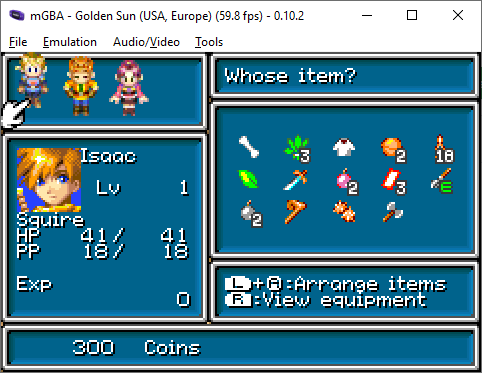
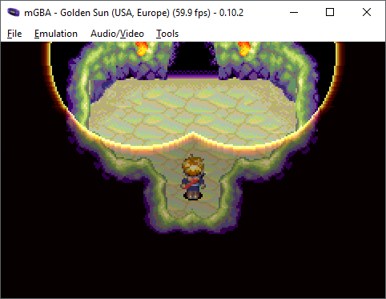

# Consistent Beginner Friendly ACE setup for GS1:

### Step 1: Acquire this inventory



```
Bone, Herb*3, Cotton Shirt, Nut*2, Elixir*18
Mint, Bandit's Sword, Sleep Bomb*2, Game Ticket*3, Mace(E)
Smoke Bomb*2, Shaman's Rod, Bramble Seed, Battle Axe
```

Ensure that the items are in the correct order.

### Step 2: Save inside of Lunpa Fortress



### Step 3: Enter Tret
Run up the vine ladder in the back of the room, run out the left door, drain your pp to 5 or less, cast retreat with L or R (you should get the message **"Not enough PP"**), and save in another slot.


### Step 4: Out of bounds
Hard reset, and load the Tret save.  Cast Avoid or use a Sacred Feather to disable encounters.  Run Up+Right until you see Isaac.  Run around the top of the room until you're standing in this corner:


### Step 5: Move to the spot
Run right for at least 1 second.
Run up for at least 9 seconds.
Save over the Tret file.

### Step 6: Load Lunpa Fortress
Hard reset, then load the Lunpa file.
Soft reset, then load the Tret file.
If you are unable to make savestates, then you can return to this step after any mistakes.

### Step 7: Room Transitions
Run Up+Right for at least 1 second, then move left.  You should pop out here:


Run inside, then move down and up on the vine ladder repeatedly, for a total of 9 room transitions on the vine.  You will end up on the bottom.


Soft reset, and load the Tret file again.

### Step 8: Talk to the Water Tile
Drain your PP to zero again, and if you can, make a savestate here.
Try to move one tile to the right, then press A.  If you moved enough, you will see the text: **"Isaac peered into the water..."**
If you moved too far, the game will crash and you will be unable to open menus.  If the game crashed, or if there's no water tile, return to step 6.

### Step 9: The Final Movement
Run left for at least 2 seconds, and during the first second, try to move down at least one tile.  If you didn't move down enough, you will appear here, and will need to load your savestate:


If you moved down 2-3 tiles, then held straight left, you will appear here:


If you moved down 2-3 tiles, then held down-left, you will appear here:


In either of those cases, you have crossed over the trigger tile and Debug mode should be active.

If you moved down exactly one tile, you will not pop out anywhere.  In this case, run straight down (at least one tile, into a wall).  You may make a savestate here.  If you press A, the game will crash, but you will see the text: **"Isaac looked on the table..."**, confirming that the trigger tile is one tile directly to your left.  Stepping on that tile will trigger ACE.

### Step 10: Open Debug Menu
Press Start to see the expanded menu.  Hold B and press Start to open the teleportation menu.  Hold B and press select to open the flag menu.  Hold L and press Start to open the palette menu.  Hold L to walk through walls.


